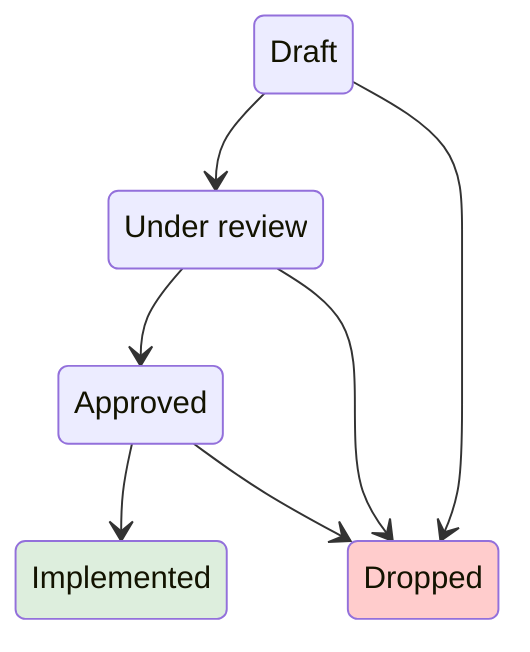

# Bazel Proposals and Design Documents

This is an index of all proposals and design documents for
[Bazel](https://bazel.build).

## Workflow

New proposals follow the [design process](https://bazel.build/designs/index.html)
and are sent for review as a [GitHub discussion](https://github.com/bazelbuild/bazel/discussions).

### State diagram of the design process

# Index

### Under review

| Last updated | Title                                                                                                                                                     | Author(s) alias                                                              | Category              |
| ------------ | --------------------------------------------------------------------------------------------------------------------------------------------------------- | ---------------------------------------------------------------------------- | --------------------- |
|   2023-06-30 | [Fingerprinting Starlark Functions](https://docs.google.com/document/d/1OYtToAPNk19yxd-b19-6VKXUg1b6KtiWqZgXhezFy0Y/edit?usp=sharing) | [@brandjon](https://github.com/brandjon) | Starlark and actions |
|   2023-06-16 | [Extending Bazel rules](https://docs.google.com/document/d/1p6z-shWf9sdqo_ep7dcjZCGvqN5r2jsPkJCqHHgfRp4/edit?usp=sharing) | [@comius](https://github.com/comius) | Starlark Rules |
|   2023-06-15 | [Integrated bzl_library](https://docs.google.com/document/d/1Q6gCrbdA2omw0uV2kN6qqoUS1hucNoVxJ-Tep8iSQAU/edit?usp=sharing) | [@brandjon](https://github.com/brandjon) | Starlark |
|   2023-06-14 | [Platform-based flags](designs/2023-06-08-platform-based-flags.md) | [@katre](https://github.com/katre) | Platforms |
|   2023-06-09 | [Standard platform transitions](designs/2023-06-08-standard-platform-transitions.md) | [@katre](https://github.com/katre) | Platforms |
|   2023-05-31 | [subrule: Decomposing Starlark rules](https://docs.google.com/document/d/1RbNC88QieKvBEwir7iV5zZU08AaMlOzxhVkPnmKDedQ/edit?usp=sharing) | [@comius](https://github.com/comius) | Starlark Rules |
|   2023-05-04 | [Directory watching API for repo rules](https://docs.google.com/document/d/17RZKMuMjAIgNfFdrsLhqNsMTQDSS-BBA-S-fCSBPV7M/edit#) | [@Wyverald](https://github.com/Wyverald) | External Repositories |
|   2023-03-17 | [C/C++ standard resolution for Bazel modules](https://docs.google.com/document/d/132vEDnQZY0PtF9ko6HoLQ2dqk6meZnSrUfc1gsKuBkk/edit?usp=sharing) | [@fmeum](https://github.com/fmeum) | C++, External Repositories |
|   2023-03-17 | [More accurate cquery](https://docs.google.com/document/d/1x-RqFFEcGIzVgtYHIq6s6Qt4vYtJWz3nuHIuqeI89dU/edit#) | [@gregestren](https://github.com/gregestren) | Configurability |
|   2022-10-17 | [Dependency adapters for virtual targets](designs/2022-10-17-dependency-adapter.md) | [@vdye](https://github.com/vdye) | Bazel |

### Draft

| Last updated | Title                                                                                                                           | Author(s) alias                          | Category |
|--------------|---------------------------------------------------------------------------------------------------------------------------------|------------------------------------------|----------|
|   2023-01-18 | [Modular cc toolchains](https://docs.google.com/document/d/1-etGNsPneQ8W7MBMxtLloEq-Jj9ng1G-Pip-cWtTg_Y/edit?usp=sharing) | [@silvergasp](https://github.com/silvergasp) | CC toolchain rules |
|   2022-05-31 | [Bazel Proto Rules](https://docs.google.com/document/d/1l5JrFOxjU1USWXoc_KeBIjBoae5nkaL5AqhNiHLYeyI/edit?usp=sharing) | [@comius](https://github.com/comius) | Proto Rules |
|   2020-10-09 | [Adding http mirror to accelerate repos downloading](designs/2020-10-09-http-mirror.md) | [@yancl](https://github.com/yancl) | External Repositories |
|   2021-06-25 | [Better Starlark analysis unit tests](https://docs.google.com/document/d/12sC92mq7WasTvDWsm4U782oCegitfi1jbgOnMIGCe-A/edit?usp=sharing) | [@hvadehra](https://github.com/hvadehra) | Starlark |
|   2022-04-25 | [Extend expand_template() API to reduce retained memory](https://docs.google.com/document/d/1Bjos2J0eLfxiy3_GU7LxOlciJAAqcbZCIIZ2VK0o5Wo/edit?usp=sharing) | [@hvadehra](https://github.com/hvadehra) | Starlark |
|   2022-04-29 | [@since(version) annotations in documentation.](https://docs.google.com/document/d/17JBmzeY2NpCWbAGQjsqtmMRLOl0n8IcPYCMOYyFsG1k/edit#) | [@aiuto](https://github.com/aiuto) | Documentation |

### Approved

| Last updated | Title                                                                                                                  | Author(s) alias                                                                    | Category              |
| ------------ | ------------------------------------------------------------------------------------------------------------------     | ---------------------------------------------------------------------------------- | --------              |
|   2023-06-12 | [Remote Output Service: place bazel-out/ on a FUSE file system](designs/2021-02-09-remote-output-service.md)                                              | [@EdSchouten](https://github.com/EdSchouten)                                 | Remote Execution      |
|   2023-03-21 | [Bazel feature detection in Starlark](https://docs.google.com/document/d/1HJf3gMYIrzmTRqbD4nWXH2eJRHXjLrOU0mmIeZplUzY/edit#) | [@Wyverald](https://github.com/Wyverald) | General, Starlark Rules |
|   2023-03-14 | [REPO.bazel](https://docs.google.com/document/d/1rS-B3d_sfZFY2AcSwIq2ibQc7X1lgeycddLJqjYKgOA/edit) | [@Wyverald](https://github.com/Wyverald) | External Repositories |
|   2023-03-07 | [Build Stamping API for Starlark rules](https://docs.google.com/document/d/1YNC0DvT0l1ZC5DuwXlSeEX_d-bGEKRK-z81UBXEhEVE/edit?usp=sharing) | [@buildbreaker2021](https://github.com/buildbreaker2021) | Starlark Rules |
|   2023-01-23 | [Remote Cache Eviction for Build without the Bytes](https://docs.google.com/document/d/1wM61xufcMS5W0LQ0ar5JBREiN9zKfgu6AnHVD7BSkR4/edit#) | [@coeuvre](https://github.com/cowuvre) | Remote Execution |
|   2022-10-11 | [Renaming applicable_licenses](https://docs.google.com/document/d/1uyJjkKbE8kV8EinakaR9q-Un25zCukhoH_dRBkWHSKQ) | [@aiuto](https://github.com/aiuto) | Configuration |
|   2023-01-30 | [Transitive static libraries](https://docs.google.com/document/d/1jN0LUmp6_-rV9_f-Chx-Cs6t_5iOm3fziOklzBGjGIg/edit?usp=sharing) | [@fmeum](https://github.com/fmeum) | C++ |
|   2023-03-20 | [Automatic use_repo fixups for module extensions](https://docs.google.com/document/d/1dj8SN5L6nwhNOufNqjBhYkk5f-BJI_FPYWKxlB3GAmA/edit) | [@fmeum](https://github.com/fmeum) | External Repositories |
|   2022-12-15 | [Bzlmod lockfile](https://docs.google.com/document/d/1HPeH_L-lRK54g8A27gv0q7cbk18nwJ-jOq_14XEiZdc/edit#heading=h.5mcn15i0e1ch) | [@salmasamy](https://github.com/SalmaSamy) | Bazel, External Repositories |
|   2022-12-07 | [Exec platform per toolchain](https://docs.google.com/document/d/1-rbP_hmKs9D639YWw5F_JyxPxL2bi6dSmmvj_WXak9M/edit?usp=sharing) |  [@comius](https://github.com/comius) [@kotlaja](https://github.com/kotlaja) | Configurability |
|   2022-08-17 | [Locating runfiles with Bzlmod](designs/2022-07-21-locating-runfiles-with-bzlmod.md) | [@fmeum](https://github.com/fmeum) | External Repositories, Bazel |
|   2022-05-12 | [Bzlmod External Dependencies Inspection Tool](https://docs.google.com/document/d/1akmJfcEQ2jlB9E4ADQvKA1LNpWE87rdCMwV_Mq8Mqwc/edit?usp=sharing)                           | [@andyrinne12](https://github.com/andyrinne12)                       | External Repositories      |
|   2022-05-11 | [Deprecating managed_directories](https://docs.google.com/document/d/1u9V5RUc7i6Urh8gGfnSurxpWA7JMRtwCi1Pr5BHeE44/edit?usp=sharing)                                              | [@lberki](https://github.com/lberki)                                 | External Repositories      |
|   2021-02-15 | [External directory reshuffling](https://docs.google.com/document/d/1X1-JkqkmzvYmDHnr3OyHpFyKgoFb7K2BXs0xgYcetiM/edit#) | [@lberki](https://github.com/lberki) | External Repositories |
|   2021-02-15 | [C++ rules skylark migration plan](https://docs.google.com/document/d/1Adqu7--verca4gCh3ZdnVMjjCz4VzurHxKEZAh9u03E)                | [@mhlopko](https://github.com/mhlopko)                                         | C++                   |
|   2019-05-08 | [Android Native to Starlark Migration](https://docs.google.com/document/d/175BlYH-Z_V_FFGAVP-JA5FowLATRjY_MtOrglxFnfcE/edit)                                                                      | [@timpeut](https://github.com/timpeut)             | Android |
|   2018-08-14 | [Decoupling `android_ndk_repository` from Bazel](https://docs.google.com/document/d/1VwZSiuzK8xhRxM1N_S50WjRCxMOo7wLWqO3PKrwqZqU/edit#) | [@jin](https://github.com/jin) | Android |
|   2018-07-31 | [Splitting large BEP events](https://docs.google.com/document/d/1O1vXaIiXPfSJZv__OaEHHoMftE7PwlAFePmF-mfN3pQ) | [@buchgr](https://github.com/buchgr) | Build Event Protocol |

### Implemented

| Last updated | Title                                                                                                                                      | Author(s) alias                                  | Category              |
| ------------ | ------------------------------------------------------------------------------------------------------------------------------------------ | ------------------------------------------------ | --------              |
|   2023-06-13 | [Credential Helpers for Bazel](designs/2022-06-07-bazel-credential-helpers.md) | [@Yannic](https://github.com/Yannic) | External Repositories |
|   2022-03-18 | [proto_common module](https://docs.google.com/document/d/1dY_jfRvnH8SjRXGIfg8av-vquyWsvIZydXJOywvaR1A/edit?usp=sharing) | [@comius](https://github.com/comius)                                 | Proto Rules |
|   2021-06-23 | [Improving native.existing_rules](designs/2021-06-15-improving-native.existing_rules.md)                               | [@tetromino](https://github.com/tetromino), [@brandjon](https://github.com/brandjon) | Build Language      |
|   2021-06-09 | [Aspects Propagating other Aspects](https://docs.google.com/document/d/1WPq2g__IwrsSsxn4-rcfTSQODDtnKQTDhnHvtA37nlQ/edit?usp=sharing) | [@messa](https://github.com/mai93) | Starlark |
|   2021-04-22 | [Custom constructors for providers](https://docs.google.com/document/d/1peAeaMOh9AkDgzMcOeJPkMCChYjFCkfdsPsKhgOxwfY/edit?usp=sharing)                                              | [@brandjon](https://github.com/brandjon)                                 | Build Language      |
|   2021-03-24 | [Java common refactoring](https://docs.google.com/document/d/10isTEK5W9iCPp4BIyGBrLY5iti3Waaam6EeGVSjq3r8/edit?usp=sharing)                                             | [@comius](https://github.com/comius)                                 | Java rules      |
|   2020-12-22 | [Injecting Starlark Values Into Builtins](https://docs.google.com/document/d/1GW7UVo1s9X0cti9OMgT3ga5ozKYUWLPk9k8c4-34rC4/edit#) | [@brandjon](https://github.com/brandjon) | Starlark |
|   2021-03-06 | [OSS License Declarations](https://docs.google.com/document/d/1XszGbpMYNHk_FGRxKJ9IXW10KxMPdQpF5wWbZFpA4C8) | [@aiuto](https://github.com/aiuto)                                 | Product |
|   2021-02-15 | [Rules for software license compliance](https://docs.google.com/document/d/1uwBuhAoBNrw8tmFs-NxlssI6VRolidGYdYqagLqHWt8)     | [@aiuto](https://github.com/aiuto) | License Rules, Bazel |
|   2023-03-31 | [Optional Toolchains](designs/2022-01-21-optional-toolchains.md) | [@katre](https://github.com/katre) | Configurability |
|   2022-05-25 | [Canonical label literals](https://docs.google.com/document/d/1N81qfCa8oskCk5LqTW-LNthy6EBrDot7bdUsjz6JFC4/edit#)                                         | [@Wyverald](https://github/Wyverald)                                         | External Repositories |(https://github.com/ulfjack)                                 | Remote Execution      |
|   2022-03-07 | [Representing repeatable Starlark flags as config.string_list](designs/2022-03-06-representation-of-repeatable-starlark-flags.md) | [@fmeum](https://github.com/fmeum) | Configurability, Build Language |
|   2022-01-14 | [Proposal for subpackages built-in helper function](https://docs.google.com/document/d/13UOT0GoQofxDW40ILzH2sWpUOmuYy6QZ7CUmhej9vgk/edit?usp=sharing) | [@kkress](https://github.com/kkress)                                 | Bazel |
|   2021-08-02 | [Bazel Central Registry Policies and Procedures](https://docs.google.com/document/d/1ReuBBp4EHnsuvcpfXM6ITDmP2lrOu8DGlePMUKvDnXM/edit?usp=sharing) | [@meteorcloudy](https://github.com/meteorcloudy)                                 | External Repositories |
|   2021-03-06 | [Remote Persistent Workers](designs/2021-03-06-remote-persistent-workers.md)                                              | [@ulfjack]
|   2021-03-06 | [Rules authors SIG](designs/2021-08-10-rules-authors-sig.md) | [@alexeagle](https://github.com/alexeagle)                                 | Community |
|   2021-02-18 | [Require ProtoInfo for proto_lang_toolchain#blacklisted_protos](https://docs.google.com/document/d/1UmF_P4NDVl6Nw4JsHoHYp74iCdEQNh1O3-SVAX1CdjU/edit#) | [@Yannic](https://github.com/Yannic)   | Protobuf |
|   2021-02-16 | [Selecting Between Python 2 and 3](https://github.com/bazelbuild/rules_python/blob/master/proposals/2018-10-25-selecting-between-python-2-and-3.md)                            | [@brandjon](https://github.com/brandjon)                                           | Python |
|   2021-02-16 | [Remote Downloads](designs/2020-01-14-remote-downloads.md) | [@EricBurnett](https://github.com/EricBurnett), [@jmillikin](https://john-millikin.com), [@sstriker](https://github.com/sstriker) | External Repositories |
|   2021-02-16 | [Starlark Directory Expansion in Args MapEach](https://docs.google.com/document/d/14MalcSscNHKriA9aHalRQSwNggSPO0JzSLbwzQMO_so) | [@haileiyu](https://github.com/haileiyu)   | Starlark |
|   2021-02-16 | [Test execution on Windows without Bash](https://github.com/laszlocsomor/proposals/blob/win-test-runner/designs/2018-07-18-windows-native-test-runner.md) | [@laszlocsomor](https://github.com/laszlocsomor) | Windows  |
|   2021-02-15 | [Toolchain resolution using configuration flags](https://docs.google.com/document/d/13yXhOQeMZQmlW3obyZ7fJP3sm3eVLbK3Nuk2LZjcZiU/edit?usp=sharing)                                          | [@comius](https://github.com/comius)       | Configurability |
|   2021-02-15 | [Configured Query Starlark Output](https://docs.google.com/document/d/1kL6Tdmp6uLBa9lq_DbUSjIC87glOzKIyPoBeF95Rs4c/edit#) | [@c-parsons](https://github.com/c-parsons) | Configurability, Starlark |
|   2021-02-15 | [Proposal: new format ‘flag_per_line’ for Args](https://docs.google.com/document/d/1nyxfVn7KAAi1sKvHCfrOjfONkhK8RYhvAesrAok3sJ8/edit?usp=sharing) | [@vmaverick](https://github.com/vmaverick)   | Starlark |
|   2021-02-15 | [cquery somepath: easy mode](https://docs.google.com/document/d/1ZbcOi8htQrKichHGWq6Dc8-HI7oFjvoBYeRoTedsgWY/)                                                                               | [@gregestren](https://github.com/gregestren)                                         | Configurability |
|   2021-02-15 | [Automatically migrating `maven_jar` to `rules_jvm_external`](https://docs.google.com/document/d/1CqxPv-TwvFWBHgtg7_QhVfck4vH4rnmCU_IuMdC7O2M/edit#) | [@jin](https://github.com/jin) | External Repositories |
|   2021-02-15 | [Target-level execution properties](https://docs.google.com/document/d/1w3fu8zu_sRw_gK1dFAvkY2suhbQQ82tc0zdjet-dpCI/edit#)                 | [@agoulti](https://github.com/agoulti)           | Configurability       |
|   2021-02-15 | [Bazel Starlark API: add ctx.resolve_tools](https://docs.google.com/document/d/1xPsvTY-vWav9zX--7ieXjUilcl7M46m-88_oNV0QhEU/edit) | [@laszlocsomor](https://github.com/laszlocsomor) |  Starlark |
|   2021-02-15 | [Auto-configured Host Platform](designs/2018-10-22-autoconfigured-host-platform.md)                                    | [@katre](https://github.com/katre)                                                 | Configurability       |
|   2021-02-15 | [Multiplex persistent worker](https://docs.google.com/document/d/1OC0cVj1Y1QYo6n-wlK6mIwwG7xS2BJX7fuvf1r5LtnU/edit?usp=sharing)               | [@borkaehw](https://github.com/borkaehw) | Bazel |
|   2021-02-15 | [Starlark Build Configuration](https://docs.google.com/document/d/1vc8v-kXjvgZOdQdnxPTaV0rrLxtP2XwnD2tAZlYJOqw)                     | [@juliexxia](https://github.com/juliexxia), [@gregestren](https://github.com/gregestren)                                   | Configurability       |
|   2021-02-15 | [Crosstool in Skylark](https://docs.google.com/document/d/1Nqf16jqDGWSrPp4VuRxh0iNnVBoAXsO0meDH69J9xoc/edit)           | [@scentini](https://github.com/scentini), [@mhlopko](https://github.com/mhlopko)   | C++                   |
|   2021-02-15 | [Extensibility For Native Rules](https://bazel.build/designs/2016/08/04/extensibility-for-native-rules.html)           | [@dslomov](https://github.com/dslomov)                                             | Starlark               |
|   2021-02-15 | [Declared Providers](https://bazel.build/designs/skylark/declared-providers.html)                                      | [@dslomov](https://github.com/dslomov), [@laurentlb](https://github.com/laurentlb) | Starlark               |
|   2021-02-15 | [Java Platformization](https://docs.google.com/document/d/1MVbBxbKVKRJJY7DnkptHpvz7ROhyAYy4a-TZ-n7Q0r4/edit)                                          | [@comius](https://github.com/comius)       | Configurability |
|   2021-02-15 | [Starlark Shorthand Flag Mapping](https://docs.google.com/document/d/1qDz9VEJNEY-sybYCg53WqIQFbsBMR3gVDYbFFwS1OM4/edit?usp=sharing) | [@WarkahScott](https://github.com/WarkahScott) | Configurability |
|   2021-02-15 | [Measuring Configuration Overhead](https://docs.google.com/document/d/10ZxO2wZdKJATnYBqAm22xT1k5r4Vp6QX96TkqSUIhs0/) | [@gregestren](https://github.com/gregestren) | Configurability |
|   2021-02-15 | [Action Groups (Multi-Toolchain Resolution)](https://docs.google.com/document/d/1m9xLRLg09lncQTuBUMhhG_lqDQGJRYMZPejvwdBXvqo/edit?usp=sharing) | [@juliexxia](https://github.com/juliexxia) | Configurability |
|   2021-02-15 | [Common Bazel Constraints](https://docs.google.com/document/d/1bqPF7CjHI03xHZmpy8gOE186uNjeU3dGYU8v2t-qiJ8/edit)     | [@gregestren](https://github.com/gregestren) | Configurability |
|   2021-02-15 | [Starlark Build Configurations - Parameterized-Transitions API](https://docs.google.com/document/d/1VIRx06cZB4wLU-ASq1XKFHmx67yfHtNOCbCempaPeaA)           | [@juliexxia](https://github.com/juliexxia)                                   | Configurability       |
|   2021-02-15 | [Partial C++ Starlark API](https://docs.google.com/document/d/1_irTE1a8aTg8Hhf5mmlEXsFcwOw6-hz3a8FxufCyVKA/edit?ts=5bcf15dc#heading=h.7795zogmlqtv)       | [@oquenchil](https://github.com/oquenchil)                                   | C++                   |
|   2021-02-15 | [Crosstool in Skylark](https://docs.google.com/document/d/1Nqf16jqDGWSrPp4VuRxh0iNnVBoAXsO0meDH69J9xoc)                                                   | [@mhlopko](https://github.com/mhlopko)                                       | C++                   |
|   2021-02-15 | [Shrinking the Bazel binary](https://docs.google.com/document/d/1Igmv-2GfXkoVFWTXvBYPeniQom8nLAwzqzridDlBIS4/edit)                 | [@buchgr](https://github.com/buchgr), [@meistert](https://github.com/meistert) | Bazel                 |
|   2021-02-15 | [External C/C++ libraries rules](https://docs.google.com/document/d/1Gv452Vtki8edo_Dj9VTNJt5DA_lKTcSMwrwjJOkLaoU/edit?usp=sharing) | [@ichern](https://github.com/irengrig)                                         | Bazel                 |
|   2021-02-15 | [Bazel Runfiles Libraries](https://docs.google.com/document/d/e/2PACX-1vSDIrFnFvEYhKsCMdGdD40wZRBX3m3aZ5HhVj4CtHPmiXKDCxioTUbYsDydjKtFDAzER5eg7OjJWs3V/pub) | [@laszlocsomor](https://github.com/laszlocsomor) | Bazel                 |
|   2021-02-15 | [Name resolution](designs/2018-06-18-name-resolution.md)                                                                       | [@laurentlb](https://github.com/laurentlb)                                     | Starlark               |
|   2020-10-28 | [Keepalived remote execution](https://docs.google.com/document/d/1NgDPsCIwprDdqC1zj0qQrh5KGK2hQTSTux1DAvi4rSc/edit) | [@coeuvre](https://github.com/coeuvre) | Remote Execution |
|   2020-10-19 | [Bazel External Dependencies Overhaul](https://docs.google.com/document/d/1moQfNcEIttsk6vYanNKIy3ZuK53hQUFq1b1r0rmsYVg/edit)                                          | [@meteorcloudy](https://github.com/meteorcloudy), [@philwo](https://github.com/philwo), [@Wyverald](https://github.com/Wyverald)       | External Repositories |
|   2020-09-30 | [Toolchain Transition Migration](designs/2020-02-07-toolchain-transition-migration.md)                                          | [@katre](https://github.com/katre)       | Configurability |
|   2020-09-30 | [Toolchain Transitions](designs/2019-02-12-toolchain-transitions.md) | [@katre](https://github.com/katre) | Configurability |
|   2020-09-30 | [Passing Toolchain Context across Dependencies](designs/2020-05-13-toolchain-context-dependencies.md) | [@katre](https://github.com/katre) | Configurability |
|   2020-05-13 | [Execution Transitions](designs/2019-02-12-execution-transitions.md) | [@katre](https://github.com/katre) | Configurability |
|   2020-05-13 | [Old Flags to Platform Migration](https://docs.google.com/document/d/1Vg_tPgiZbSrvXcJ403vZVAGlsWhH9BUDrAxMOYnO0Ls) | [@aragos](https://github.com/aragos) |  Configurability |
|   2019-12-20 | [Incompatible Target Skipping](https://docs.google.com/document/d/12n5QNHmFSkuh5yAbdEex64ot4hRgR-moL1zRimU7wHQ/edit?ts=5dfbe2fe)               |  [@AustinSchuh](https://github.com/AustinSchuh), [@gregestren](https://github.com/gregestren)                                        | Configurability
|   2019-12-17 | [cquery somepath: easy mode](https://docs.google.com/document/d/1ZbcOi8htQrKichHGWq6Dc8-HI7oFjvoBYeRoTedsgWY/)                                                                               | [@gregestren](https://github.com/gregestren)                                         | Configurability
|   2019-12-17 | [Exposing Target Platform Constraints](designs/2019-11-11-target-platform-constraints.md)                                       | [@katre](https://github.com/katre)       | Configurability |
|   2019-10-24 | [Visibility for source files](designs/2019-10-24-file-visibility.md)                                                                                      | [@aehlig](https://github.com/aehlig)                                         | Build API
|   2019-04-22 | [Move //tools/build_defs/pkg to rules_pkg](https://docs.google.com/document/d/1GAbAiW0nVbxGlwsdXhFIcn3owlZJkMJiXBt-ttA9z_k/edit)     | [@aiuto](https://github.com/aiuto) | Bazel |
|   2019-05-10 | [Bazel with NPM package manager](https://docs.google.com/document/d/1uaeQpPrSH4q46zGuXLgtzMkLVXk7Er9I-P_-ScwwGLk/edit?usp=sharing)         | [@ichern](https://github.com/irengrig)           | External Repositories |
|   2019-05-27 | [Authentication for `ctx.download`](designs/2019-05-27-auth.md)                                                        | [@aehlig](https://github.com/aehlig)                                               | External Repositories |
|   2019-04-29 | [Forcing non-cache-hits in the repository cache](designs/2019-04-29-cache.md)                                                              | [@aehlig](https://github.com/aehlig)             | External Repositories |
|   2019-04-05 | [Handling download failures](designs/2019-03-21-download-failures.md)                                                                      | [@aehlig](https://github.com/aehlig)             | External Repositories |
|   2018-12-14 | [Versioned Documentation](https://docs.google.com/document/d/1MNe8IWz7td4_Yr3r43YL-hrFSmQvFutum-av-Sny56s/edit#)                           | [@jin](https://github.com/jin)                   | Documentation         |
|   2018-11-26 | [Update Download Functions in repository_ctx](https://docs.google.com/document/d/1znnk1u3kdl4iOh3ptmJnW7nHr8UtkVl__Au4atLzNKc)             | [@dkelmer](https://github.com/dkelmer)           | External Repositories |
|   2018-11-14 | [Platform Inheritance](designs/2018-10-09-platform-inheritance.md)                                                                         | [@katre](https://github.com/katre)               | Configurability       |
|   2018-11-09 | [Config Setting Chaining](designs/2018-11-09-config-setting-chaining.md)                                                                   | [@gregestren](https://github.com/gregestren)     | Configurability       |
|   2018-10-29 | [Progress reporting for external repositories](designs/2018-10-29-external-repositories-reporting.md)                                      | [@aehlig](https://github.com/aehlig)             | External Repositories |
|   2018-11-10 | [Symlinks in Remote Execution](https://docs.google.com/document/d/1zqXCrQk1gF6kRvHXxpMiEfZGNBJ7rlVN8PeBl195_Zc)                            | [@buchgr](https://github.com/buchgr)              | Remote Execution      |
|   2018-08-27 | [Args Directory Support](https://docs.google.com/document/d/11agWFiOUiz2htBLj6swPTob5z78TrCxm8DQE4uJLOwM)                                  | [@tomlu](https://github.com/tomlu)               | Starlark               |
|   2018-08-20 | [Skylark API to the C++ toolchain](https://docs.google.com/document/d/1g91BWJITcYw_X-VxsDC0VgUn5E9g0kRBGoBSpoO41gA/edit)                   | [@mhlopko](https://github.com/mhlopko)           | C++                   |
|   2018-08-03 | [Skyframe threading model](https://docs.google.com/document/d/1nqlwcQXxBSDKuSz2Ml_trdGJI71lQ5zXTw2CBFwqW4U/edit)                           | [@tomlu](https://github.com/tomlu)               | Skyframe              |
|   2018-07-13 | [Bazel hashing of external directory output](designs/2018-07-13-repository-hashing.md)                                                     | [@aehlig](https://github.com/aehlig)             | External Repositories |
|   2018-05-24 | [Unified Configuration Transitions](https://docs.google.com/document/d/1_UJKmAQ9EE8i3Pl0il3YLTYr-Q9EKYYyLatt2zohfyM/edit#heading=h.96gongkwg852)                           | [@gregestren](https://github.com/gregestren)               | Configurability              |
|   2018-04-26 | [Per-Rule Execution Platform Constraints](https://docs.google.com/document/d/1p1J2ktWTpoKvNATjC6U29vhz1_-Dgbe9YRPr5wisfzY)                 | [@katre](https://github.com/katre)               | Configurability       |
|   2017-10-06 | [Dynamic Bazel Configurations](https://docs.google.com/document/d/1uoU8t7loTOu6uyzez-ilhcYgEXg4xjViJu0aqrf69TY/edit#heading=h.xsc8wmorka3u)     | [@gregestren](https://github.com/gregestren) | Configurability
|   2017-03-03 | [Label-keyed String Dictionary Type for Build Attributes](https://bazel.build/designs/2017/03/03/label-keyed-string-dict-type.html)        | [@serynth](https://github.com/serynth)           | Configurability       |
|   2017-01-20 | [Aspect required providers](https://docs.google.com/document/d/1WZmUsCrI2RkUyIqUVVVgIgDKIpaXsMzKPDGTeJzGfi0/)                                 | [@tomlu](https://github.com/tomlu), [@dslomov](https://github.com/dslomov)         | Starlark |
|   2017-01-20 | [Aspects-on-aspects](https://docs.google.com/document/d/1TXiG3mqX19akwhJ_1Zjxpqrxov3XFsicj78VuhyO0Ts/)                                 | [@dslomov](https://github.com/dslomov)         | Starlark |
|   2016-10-18 | [Invalidation of remote repositories](https://bazel.build/designs/2016/10/18/repository-invalidation.html)                                 | [@damienmg](https://github.com/damienmg)         | External Repositories |
|   2016-10-11 | [Distribution Artifact for Bazel](https://bazel.build/designs/2016/10/11/distribution-artifact.html)                                       | [@aehlig](https://github.com/aehlig)             | Release               |
|   2016-09-30 | [Central cache for external repositories](https://bazel.build/designs/2016/09/30/repository-cache.html)                                    | [@jin](https://github.com/jin)                   | External Repositories |
|   2016-09-05 | [Building Python on Windows](https://bazel.build/designs/2016/09/05/build-python-on-windows.html)                                          | [@meteorcloudy](https://github.com/meteorcloudy) | Python, Windows       |
|   2016-06-21 | [Specifying environment variables](https://bazel.build/designs/2016/06/21/environment.html)                                                | [@aehlig](https://github.com/aehlig)             | Bazel                 |
|   2016-06-02 | [Sandboxing](https://bazel.build/designs/2016/06/02/sandboxing.html)                                                                       | [@philwo](https://github.com/philwo)             | Bazel                 |
|   2016-05-26 | [Implementing Beautiful Error Messages (Loading Phase)](https://bazel.build/designs/2016/05/26/implementing-beautiful-error-messages.html) | [@laurentlb](https://github.com/laurentlb)       | Bazel                 |
|   2016-05-23 | [Beautiful error messages](https://bazel.build/designs/2016/05/23/beautiful-error-messages.html)                                           | [@laurentlb](https://github.com/laurentlb)       | Bazel                 |
|   2016-04-18 | [Parameterized Skylark Aspects](https://bazel.build/designs/skylark/parameterized-aspects.html)                                            | [@dslomov](https://github.com/dslomov), lindleyf | Starlark               |
|   2016-02-16 | [Generating C++ crosstool with a Skylark Remote Repository](https://bazel.build/designs/2016/02/16/cpp-autoconf.html)                      | [@damienmg](https://github.com/damienmg)         | Toolchains            |
|   2015-07-02 | [Skylark Remote Repositories](https://bazel.build/designs/2015/07/02/skylark-remote-repositories.html)                                     | [@damienmg](https://github.com/damienmg)         | External repositories |

### Dropped

| Last updated | Title                                                                                                           | Author(s) alias                            | Category              |
|--------------|-----------------------------------------------------------------------------------------------------------------|--------------------------------------------|-----------------------|
|   2023-06-21 | [Integrated bzl_library](https://docs.google.com/document/d/1Q6gCrbdA2omw0uV2kN6qqoUS1hucNoVxJ-Tep8iSQAU/edit?usp=sharing) | [@brandjon](https://github.com/brandjon) | Starlark |
|   2022-02-18 | [Coding guidelines for Starlark rules](https://docs.google.com/document/d/1uuX1Gz6Kvivp-oOqGja342VrVO534PLF0m_zFtFIBcc/edit?usp=sharing) | [@comius](https://github.com/comius)                                 | Starlark Rules |
|   2019-07-11 | [Load Bazel Protobuf rules from @rules_proto](https://docs.google.com/document/d/1Wai_okIK_NnhNJZai5nkTUvZVHdV5pp1YwNLFtWwpC4/edit?usp=sharing) | [@Yannic](https://github.com/Yannic) | Protobuf |
|   2022-07-07 | [Enabling Global exec_groups](https://github.com/bazelbuild/proposals/new/main/designs/2022-07-07_global_exec_groups.md)                           | [@susinmotion](https://github.com/susinmotion)  |  Configurability     |
|   2021-06-17 | [Starlark fail(errorcode="")](https://docs.google.com/document/d/1N98CCcZ8pCLDfh9U2hRwSdSvsiSjKdZ2cHWyiQ1PWRE) | [@aiuto](https://github.com/aiuto)                                 | Documentation / Event Stream |
|   2023-03-31 | [Execution Platforms vs. Strategies](https://docs.google.com/document/d/1U9HzdDmtRnm244CaRM6JV-q2408mbNODAMewcGjnnbM/edit#)| [@katre](https://github.com/katre) and [@aragos](https://github.com/aragos) | Configurability |
|   2021-02-18 | [Toolchainifying proto rules](https://docs.google.com/document/d/1go3UMwm2nM8JHhI3MZrtyoFEy3BYg5omGqQmOwcjmNE/edit?usp=sharing)                                              | [@Yannic](https://github.com/Yannic)                                 | Protobuf      |
|   2023-03-30 | [Guidance for Rules Authors how to deal with Bazel versions / upgrades](https://docs.google.com/document/d/1s_8AihGXbYujNWU_VjKNYKQb8_QGGGq7iKwAVQgjbn0/edit?usp=sharing) | [@philwo](https://github.com/philwo)                                 | Bazel |
|   2022-11-16 | [Platforms on Targets](designs/2022-08-03-platforms-on-targets.md) | [@katre](https://github.com/katre) | Configuration |
|   2021-07-21 | [Monorepo Toolchain Registration](designs/2021-07-08-monorepo-toolchain-registration.md) | [@katre](https://github.com/katre) | Toolchains |
|   2021-02-16 | [Semantics of the expansion of Labels](https://docs.google.com/document/d/1bEhKy1lQB-EIpNxSYgRLtZ8p07dRe0g-t7D5j5jxLb0)| [@aehlig](https://github.com/aehlig)                                               | External Repositories |
|   2021-02-16 | [Propagate tags from the targets to actions](https://docs.google.com/document/d/1X2GtuuNT6UqYYOK5lJWQEdPjAgsbdB3nFjjmjso-XHo/edit?usp=sharing)| [@ishikhman](https://github.com/ishikhman)              | Bazel, Starlark       |
|   2021-02-16 | [Remote Repository Cache](https://docs.google.com/document/d/1aagKnM8kRmMvLqSXasShsI-NYOBZYtgNrbYWLPwBoBg/edit)                 | [jmillikin](https://john-millikin.com)   | External Repositories |
|   2021-02-16 | [Moving Skylark out of Bazel](https://docs.google.com/document/d/15ysfoMXRqZDdz0OOY1mtpeWd7LjDnXKl4fOVSLGACAY/edit?usp=sharing) | [@brandjon](https://github.com/brandjon) | Starlark  |
|   2021-02-16 | [Dependency Discovery Proposal](https://github.com/stevebillings/bazel-dependency-enhancement/blob/master/bazel-next-gen-dependency-discovery-PRD.md) | [@stevebillings](https://github.com/stevebillings)   | External Repositories |
|   2021-02-16 | [s/skydoc/stardoc/g: a plan](https://docs.google.com/document/d/1HrUHFyfU0HpWG6F6ws-8zESZ16h4N7p8WsOPR9iqJbo/edit#)| [@jin](https://github.com/jin) | Documentation |
|   2021-02-16 | [Experimental Content-Based Output Paths](https://docs.google.com/document/d/17snvmic26-QdGuwVw55Gl0oOufw9sCVuOAvHqGZJFr4/edit) | [@gregestren](https://github.com/gregestren) | Configurability
|   2021-02-15 | [Managing Breaking Changes in Bazel](https://docs.google.com/document/d/1Dj5PBLmPVg9ZyApm4GobM3y-mDgY3mVaqpRVttOe-ZQ/)| [@dslomov](https://github.com/dslomov) | Community       |
|   2021-02-15 | [Separating Build API from Bazel](https://docs.google.com/document/d/1UDEpjP_qWQRYsPRvx7TOsdB8J4o5khfhzGcWplW7zzI)     | [@c-parsons](https://github.com/c-parsons)                                         | Starlark               |
|   2021-02-15 | [Improved Command Line Reporting](https://bazel.build/designs/2017/07/13/improved-command-line-reporting.html)         | [@cvcal](https://github.com/cvcal)                                                 | Bazel                 |
|   2021-02-15 | [Bazel External Dependencies Roadmap](https://docs.google.com/document/d/1ZGoqeUI5zz2IP2LP09aTellSRNRi53bCCW6tbnKAc8o) | [@dslomov](https://github.com/dslomov)                                             | External Repositories |
|   2021-02-15 | [Aspects Propagating Other Aspects](https://docs.google.com/document/d/1fVNyskIgMoiNeOOGt57LdDmEkAShkYUKYQTkf5yD1fA/edit)                                          | [@lberki](https://github.com/lberki)       | Build API |
|   2021-02-15 | [Mandatory `load()` statements in BUILD files](https://docs.google.com/document/d/1UwgGtsWZRJxXewLCoqf1zD1Y_houN1ldwZpQ4xdoAa4/) | [@lberki](https://github.com/lberki) | Starlark |
|   2021-02-15 | [Visibility for implicit attributes](designs/2019-10-15-tool-visibility.md)                                                                               | [@aehlig](https://github.com/aehlig)                                       | Build API
|   2021-02-15 | [Structured Compiler Diagnostics](https://docs.google.com/document/d/1KCQMvUMNVUBDyDmZJ1DB80tf21MVQdyWYS0Y9D_P0as/edit)| [@illicitonion](https://github.com/illicitonion) | Build Event Protocol, Build API |
|   2021-02-15 | [Replacing native &lt;lang&gt;_proto_library rules with Starlark](https://docs.google.com/document/d/1u95vlQ1lWeQNR4bUw5T4cMeHTGJla2_e1dHHx7v4Dvg/edit#) | [@Yannic](https://github.com/Yannic) | Protobuf |
|   2021-02-15 | [Always dirty repository rules](https://docs.google.com/document/d/1tjRDH0sjujz9mP2yl2iDOssW5FoJYb6Mx8s14Z1w45A/edit#)| [@ichern](https://github.com/irengrig) | External Repositories |
|   2021-02-15 | [Design for a Python Toolchain](https://github.com/bazelbuild/rules_python/blob/master/proposals/2019-02-12-design-for-a-python-toolchain.md) | [@brandjon](https://github.com/brandjon) | Python |
|   2021-02-15 | [Bazel Federation](https://docs.google.com/document/d/1dpdZjNCdXZE7SWXKuDQHxHDfXJyXjo5JhsTo-QsudHs/edit?usp=sharing) | [@dslomov](https://github.com/dslomov), [@laurentlb](https://github.com/laurentlb) | Community |
|   2021-02-15 | [On custom shell toolchain for Bazel Starlark rules](https://docs.google.com/document/d/1oY7wqoGsbF0OBrjZhvBDbqIRf1SZ-DcEFuv9jX5brDY/edit?usp=sharing) | [@ichern](https://github.com/irengrig) | Toolchains, Starlark |
|   2021-02-15 | [Recursive Workspaces](designs/2018-11-07-design-recursive-workspaces.md)                                                                                 | [@aehlig](https://github.com/aehlig)                                         | External Repositoires |
|   2021-02-15 | [Resource auto-tuning via flags](https://docs.google.com/document/d/11N3SXtjPgGnlu0-cUU9gVegUMr5Wrjj_h8PCTGdQlB8/edit)                                    | [@jmmv](https://github.com/jmmv)                                             | Performance           |
|   2021-02-15 | [Repository Remapping Revisited](https://docs.google.com/document/d/1YBltt_jd4QTRzxkp1amsgfS6P8yBVDF4n1KGb3jcf_w/edit?usp=sharing)                        | [@dkelmer](https://github.com/dkelmer)                                       | External Repositories |
|   2021-02-15 | [Bazel Rules Curation](https://docs.google.com/document/d/1oYQ-cqmqrpVE02rphobn4F_Q-lqvch4IiUlqEy9q2Fs)                                                   | [@laurentlb](https://github.com/laurentlb)                                   | Community             |
|   2021-02-15 | [Extending the design of WORKSPACE files](https://docs.google.com/document/d/1kVNXcw3nLlfFQRR_87SGOka9DJ8nnawlYHUIK4m3s0I/)                               | [@aehlig](https://github.com/aehlig), [@dslomov](https://github.com/dslomov) | External Repositories |
|   2021-02-15 | [Namespaces when using multiple bazel repositories](https://docs.google.com/document/d/1qPOUeoqDA3eWFFXS1shWX1FT3e4BQB8yuSMrfQL4QrA)                      | [@aehlig](https://github.com/aehlig), [@dslomov](https://github.com/dslomov) | External Repositories |
|   2021-02-15 | [Delaying of `load` statements](designs/2019-01-14-delayed-load.md)                                                             | [@aehlig](https://github.com/aehlig)     | External Repositories |
|   2021-02-15 | [Repository rules with multiple return values](designs/2018-11-27-meta-rules.md)                                                | [@aehlig](https://github.com/aehlig)     | External Repositories |
|   2021-02-15 | [Diamond Splitting for External Repositories](https://docs.google.com/document/d/1254CQ8T4Rmeasg4NO1NPail2kLPC50VJ7Ok6JsoSe-c/)    | [@dslomov](https://github.com/dslomov)                                         | External Repositories |
|   2021-02-15 | [Output Map Madness](https://docs.google.com/document/d/1ic9lJPn-0VqgKcqSbclVWwYDW2eiV-9k6ZUK_xE6H5E/edit)                      | [@brandjon](https://github.com/brandjon) | Starlark  |
|   2021-02-15 | [External Repositories: The Future](https://docs.google.com/document/d/13OlvrQcPG15cnrY5InEwJ4J3rV_ykHTuHqEZVTqY2lk/) | [@aehlig](https://github.com/aehlig), [@dslomov](https://github.com/dslomov)   | External Repositories |
|   2021-02-15 | [A Brave New World for the Bazel WORKSPACE File](https://docs.google.com/document/d/1HfRGRW4MwnVUG24rw3HJIBkdEYfXlESnlKOboO97A3A/)  | [@mattmoor](https://github.com/mattmoor), [@dslomov](https://github.com/dslomov), [@davidstanke](https://github.com/davidstanke), [@damienmg](https://github.com/damienmg) | External Repositories |
|   2021-02-15 | [Garbage Collection for the Repository Cache](https://docs.google.com/document/d/1IuciCmnY0Z9naciq10G2zb94mCb9xfpFLh5ZIgMcPqU/)    | [@aehlig](https://github.com/aehlig)                                           | External Repositories |
|   2021-02-15 | [Saner Skylark Sets](https://bazel.build/designs/skylark/saner-skylark-sets.html)                                               | [@dslomov](https://github.com/dslomov)   | Starlark  |
|   2021-02-15 | [Customizing the Python Stub Template](https://github.com/bazelbuild/rules_python/blob/master/proposals/2018-11-08-customizing-the-python-stub-template.md)                            | [@brandjon](https://github.com/brandjon)                                           | Python |
|   2021-02-15 | [HTTP downloads with Authorization using .netrc](designs/2019-05-01-http-auth.md) | [@genrym](https://github.com/genrym) | External Repositories |
|   2021-02-15 | [Package Validation Proposal](https://docs.google.com/document/d/1FfRXzW5RAB7tixbd1Lac51GNqNGQN932ZuTRdg8oUWU)                  | [@kkress](https://github.com/kkress)   | Bazel, Starlark |
|   2020-10-19 | [Adding a constraint to default target platform](designs/2020-09-29-new-default-target-constraint.md) | [@comius](https://github.com/comius) | Configurability |
|   2020-09-30 | [Bazel Constraint Equality](https://docs.google.com/document/d/1vuBfhgplxaBPiocm3oEWLeFdv9tzojHozdCLRVKcfz8/edit) | [@aragos](https://github.com/aragos) | Configurability |
|   2020-09-30 | [Versioned Runtime APIs under Platforms & Toolchains](https://docs.google.com/document/d/1TkbNTpBCE1MobexzmjUEpEaYzZVVXPt1cCTK-z2bvig/edit#) | [@aragos](https://github.com/aragos) | Configurability |
|   2020-01-16 | [Starlark project files](https://docs.google.com/document/d/1Sl9J5VVuaYlckmvvSmcwBvcvKAGVKwaMo4qILFVmXpo/edit)                 | [@robbertvanginkel](https://github.com/robbertvanginkel)   | Bazel, Starlark |
|   2019-08-22 | [Non-Hermetic Tool Paths in Platforms](https://docs.google.com/document/d/1J0UtPx9YnV-9E2gDc22Cxa780W0jrn04w4CGLlmX2WQ/edit#)                                                                                    | [@aragos](https://github.com/aragos)                                           | Configurability |
|   2019-08-01 | [Platforms and Strategies](designs/2019-06-25-platforms-strategies.md)                                                                                    | [@katre](https://github.com/katre)                                           | Configurability, Execution Strategy |
|   2018-06-14 | [Platforms and Configurations](https://docs.google.com/document/d/1XyGTHgcfI9aL-JHpC-xMztEPZQauXhFzBZXTKMbgFRw) | [@katre](https://github.com/katre)         | C++, Starlark          |
|   2016-09-19 | [Recursive WORKSPACE file parsing](https://bazel.build/designs/2016/09/19/recursive-ws-parsing.html)            | [@kchodorow](https://github.com/kchodorow) | External Repositories |
|   2015-03-06 | [bazel init a.k.a ./configure for Bazel](https://bazel.build/designs/2015/03/06/bazel-init.html)                | [@damienmg](https://github.com/damienmg)   | Bazel                 |
