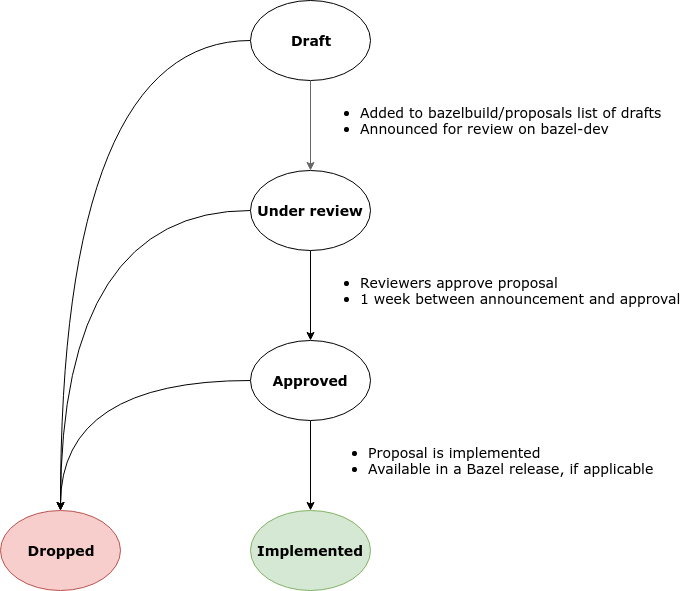

# Bazel Proposals and Design Documents

This is an index of all proposals and design documents for
[Bazel](https://bazel.build).

## Workflow

New proposals follow the [design process](https://bazel.build/designs/index.html)
and are sent for review on the
[bazel-dev](https://groups.google.com/forum/#!forum/bazel-dev) mailing
list.

### State diagram of the design process

# Index

### Implemented

| Last updated | Title                                                                                                                                      | Author(s) alias                                  | Category              |
| ------------ | ------------------------------------------------------------------------------------------------------------------------------------------ | ------------------------------------------------ | --------              |
|   2019-04-05 | [Handling download failures](designs/2019-03-21-download-failures.md)                                                                      | [@aehlig](https://github.com/aehlig)             | External Repositories |
|   2018-12-14 | [Versioned Documentation](https://docs.google.com/document/d/1MNe8IWz7td4_Yr3r43YL-hrFSmQvFutum-av-Sny56s/edit#)                           | [@jin](https://github.com/jin)                   | Documentation         |
|   2018-11-26 | [Update Download Functions in repository_ctx](https://docs.google.com/document/d/1znnk1u3kdl4iOh3ptmJnW7nHr8UtkVl__Au4atLzNKc)             | [@dkelmer](https://github.com/dkelmer)           | External Repositories |
|   2018-11-14 | [Platform Inheritance](designs/2018-10-09-platform-inheritance.md)                                                                         | [@katre](https://github.com/katre)               | Configurability       |
|   2018-10-29 | [Progress reporting for external repositories](designs/2018-10-29-external-repositories-reporting.md)                                      | [@aehlig](https://github.com/aehlig)             | External Repositories |
|   2018-11-10 | [Symlinks in Remote Execution](https://docs.google.com/document/d/1zqXCrQk1gF6kRvHXxpMiEfZGNBJ7rlVN8PeBl195_Zc)                            | [@buchgr](https://github.com/buchgr)              | Remote Execution      |
|   2018-08-27 | [Args Directory Support](https://docs.google.com/document/d/11agWFiOUiz2htBLj6swPTob5z78TrCxm8DQE4uJLOwM)                                  | [@tomlu](https://github.com/tomlu)               | Skylark               |
|   2018-08-20 | [Skylark API to the C++ toolchain](https://docs.google.com/document/d/1g91BWJITcYw_X-VxsDC0VgUn5E9g0kRBGoBSpoO41gA/edit)                   | [@mhlopko](https://github.com/mhlopko)           | C++                   |
|   2018-08-03 | [Skyframe threading model](https://docs.google.com/document/d/1nqlwcQXxBSDKuSz2Ml_trdGJI71lQ5zXTw2CBFwqW4U/edit)                           | [@tomlu](https://github.com/tomlu)               | Skyframe              |
|   2018-07-13 | [Bazel hashing of external directory output](designs/2018-07-13-repository-hashing.md)                                                     | [@aehlig](https://github.com/aehlig)             | External Repositories |
|   2018-05-24 | [Unified Configuration Transitions](https://docs.google.com/document/d/1_UJKmAQ9EE8i3Pl0il3YLTYr-Q9EKYYyLatt2zohfyM/edit#heading=h.96gongkwg852)                           | [@gregestren](https://github.com/gregestren)               | Configurability              |
|   2018-04-26 | [Per-Rule Execution Platform Constraints](https://docs.google.com/document/d/1p1J2ktWTpoKvNATjC6U29vhz1_-Dgbe9YRPr5wisfzY)                 | [@katre](https://github.com/katre)               | Configurability       |
|   2017-10-06 | [Dynamic Bazel Configurations](https://docs.google.com/document/d/1uoU8t7loTOu6uyzez-ilhcYgEXg4xjViJu0aqrf69TY/edit#heading=h.xsc8wmorka3u)     | [@gregestren](https://github.com/gregestren) | Configurability
|   2017-03-03 | [Label-keyed String Dictionary Type for Build Attributes](https://bazel.build/designs/2017/03/03/label-keyed-string-dict-type.html)        | [@serynth](https://github.com/serynth)           | Configurability       |
|   2017-01-20 | [Aspect required providers](https://docs.google.com/document/d/1WZmUsCrI2RkUyIqUVVVgIgDKIpaXsMzKPDGTeJzGfi0/)                                 | [@tomlu](https://github.com/tomlu), [@dslomov](https://github.com/dslomov)         | Starlark |
|   2017-01-20 | [Aspects-on-aspects](https://docs.google.com/document/d/1TXiG3mqX19akwhJ_1Zjxpqrxov3XFsicj78VuhyO0Ts/)                                 | [@dslomov](https://github.com/dslomov)         | Starlark |
|   2016-10-18 | [Invalidation of remote repositories](https://bazel.build/designs/2016/10/18/repository-invalidation.html)                                 | [@damienmg](https://github.com/damienmg)         | External Repositories |
|   2016-10-11 | [Distribution Artifact for Bazel](https://bazel.build/designs/2016/10/11/distribution-artifact.html)                                       | [@aehlig](https://github.com/aehlig)             | Release               |
|   2016-09-30 | [Central cache for external repositories](https://bazel.build/designs/2016/09/30/repository-cache.html)                                    | [@jin](https://github.com/jin)                   | External Repositories |
|   2016-09-05 | [Building Python on Windows](https://bazel.build/designs/2016/09/05/build-python-on-windows.html)                                          | [@meteorcloudy](https://github.com/meteorcloudy) | Python, Windows       |
|   2016-06-21 | [Specifying environment variables](https://bazel.build/designs/2016/06/21/environment.html)                                                | [@aehlig](https://github.com/aehlig)             | Bazel                 |
|   2016-06-02 | [Sandboxing](https://bazel.build/designs/2016/06/02/sandboxing.html)                                                                       | [@philwo](https://github.com/philwo)             | Bazel                 |
|   2016-05-26 | [Implementing Beautiful Error Messages (Loading Phase)](https://bazel.build/designs/2016/05/26/implementing-beautiful-error-messages.html) | [@laurentlb](https://github.com/laurentlb)       | Bazel                 |
|   2016-05-23 | [Beautiful error messages](https://bazel.build/designs/2016/05/23/beautiful-error-messages.html)                                           | [@laurentlb](https://github.com/laurentlb)       | Bazel                 |
|   2016-04-18 | [Parameterized Skylark Aspects](https://bazel.build/designs/skylark/parameterized-aspects.html)                                            | [@dslomov](https://github.com/dslomov), lindleyf | Skylark               |
|   2016-02-16 | [Generating C++ crosstool with a Skylark Remote Repository](https://bazel.build/designs/2016/02/16/cpp-autoconf.html)                      | [@damienmg](https://github.com/damienmg)         | Toolchains            |
|   2015-07-02 | [Skylark Remote Repositories](https://bazel.build/designs/2015/07/02/skylark-remote-repositories.html)                                     | [@damienmg](https://github.com/damienmg)         | External repositories |

### Approved

| Last updated | Title                                                                                                                  | Author(s) alias                                                                    | Category              |
| ------------ | ------------------------------------------------------------------------------------------------------------------     | ---------------------------------------------------------------------------------- | --------              |
|   2019-03-22 | [Execution Transitions](designs/2019-02-12-execution-transitions.md) | [@katre](https://github.com/katre) | Configurability |
|   2019-03-22 | [Toolchain Transitions](designs/2019-02-12-toolchain-transitions.md) | [@katre](https://github.com/katre) | Configurability |
|   2019-02-12 | [Bazel Constraint Equality](https://docs.google.com/document/d/1vuBfhgplxaBPiocm3oEWLeFdv9tzojHozdCLRVKcfz8/edit) | [@aragos](https://github.com/aragos) | Configurability |
|   2019-01-15 | [Bazel Starlark API: add ctx.resolve_tools](https://docs.google.com/document/d/1xPsvTY-vWav9zX--7ieXjUilcl7M46m-88_oNV0QhEU/edit) | [@laszlocsomor](https://github.com/laszlocsomor) |  Starlark |
|   2019-01-11 | [Selecting Between Python 2 and 3](https://github.com/bazelbuild/rules_python/blob/master/proposals/2018-10-25-selecting-between-python-2-and-3.md)                            | [@brandjon](https://github.com/brandjon)                                           | Python |
|   2018-11-16 | [Old Flags to Platform Migration](https://docs.google.com/document/d/1Vg_tPgiZbSrvXcJ403vZVAGlsWhH9BUDrAxMOYnO0Ls) | [@aragos](https://github.com/aragos) |  Configurability |
|   2018-11-14 | [Auto-configured Host Platform](designs/2018-10-22-autoconfigured-host-platform.md)                                    | [@katre](https://github.com/katre)                                                 | Configurability       |
|   2018-11-09 | [Config Setting Chaining](designs/2018-11-09-config-setting-chaining.md) | [@gregestren](https://github.com/gregestren) | Configurability  |
|   2018-11-05 | [Multiplex persistent worker](https://docs.google.com/document/d/1OC0cVj1Y1QYo6n-wlK6mIwwG7xS2BJX7fuvf1r5LtnU/edit?usp=sharing)               | [@borkaehw](https://github.com/borkaehw) | Bazel |
|   2018-10-15 | [Managing Breaking Changes in Bazel](https://docs.google.com/document/d/1Dj5PBLmPVg9ZyApm4GobM3y-mDgY3mVaqpRVttOe-ZQ/)| [@dslomov](https://github.com/dslomov) | Community       |
|   2018-09-04 | [Starlark Build Configuration](https://docs.google.com/document/d/1vc8v-kXjvgZOdQdnxPTaV0rrLxtP2XwnD2tAZlYJOqw)                     | [@juliexxia](https://github.com/juliexxia), [@gregestren](https://github.com/gregestren)                                   | Configurability       |
|   2018-08-20 | [Crosstool in Skylark](https://docs.google.com/document/d/1Nqf16jqDGWSrPp4VuRxh0iNnVBoAXsO0meDH69J9xoc/edit)           | [@scentini](https://github.com/scentini), [@mhlopko](https://github.com/mhlopko)   | C++                   |
|   2018-08-14 | [Decoupling `android_ndk_repository` from Bazel](https://docs.google.com/document/d/1VwZSiuzK8xhRxM1N_S50WjRCxMOo7wLWqO3PKrwqZqU/edit#) | [@jin](https://github.com/jin) | Android |
|   2018-04-19 | [Separating Build API from Bazel](https://docs.google.com/document/d/1UDEpjP_qWQRYsPRvx7TOsdB8J4o5khfhzGcWplW7zzI)     | [@c-parsons](https://github.com/c-parsons)                                         | Skylark               |
|   2018-04-06 | [Bazel External Dependencies Roadmap](https://docs.google.com/document/d/1ZGoqeUI5zz2IP2LP09aTellSRNRi53bCCW6tbnKAc8o) | [@dslomov](https://github.com/dslomov)                                             | External Repositories |
|   2018-03-29 | [Semantics of the expansion of Labels](https://docs.google.com/document/d/1bEhKy1lQB-EIpNxSYgRLtZ8p07dRe0g-t7D5j5jxLb0)| [@aehlig](https://github.com/aehlig)                                               | External Repositories |
|   2017-07-13 | [Improved Command Line Reporting](https://bazel.build/designs/2017/07/13/improved-command-line-reporting.html)         | [@cvcal](https://github.com/cvcal)                                                 | Bazel                 |
|   2016-08-04 | [Extensibility For Native Rules](https://bazel.build/designs/2016/08/04/extensibility-for-native-rules.html)           | [@dslomov](https://github.com/dslomov)                                             | Skylark               |
|   2016-06-06 | [Declared Providers](https://bazel.build/designs/skylark/declared-providers.html)                                      | [@dslomov](https://github.com/dslomov), [@laurentlb](https://github.com/laurentlb) | Skylark               |
|   2018-07-31 | [Splitting large BEP events](https://docs.google.com/document/d/1O1vXaIiXPfSJZv__OaEHHoMftE7PwlAFePmF-mfN3pQ) | [@buchgr](https://github.com/buchgr) | Build Event Protocol |

### Under review

| Last updated | Title                                                                                                                                                     | Author(s) alias                                                              | Category              |
| ------------ | --------------------------------------------------------------------------------------------------------------------------------------------------------- | ---------------------------------------------------------------------------- | --------------------- |
|   2019-04-16 | [Common Bazel Constraints](https://docs.google.com/document/d/1bqPF7CjHI03xHZmpy8gOE186uNjeU3dGYU8v2t-qiJ8/edit)     | [@gregestren](https://github.com/gregestren) | Configurability |
|   2019-04-09 | [Experimental Content-Based Output Paths](https://docs.google.com/document/d/17snvmic26-QdGuwVw55Gl0oOufw9sCVuOAvHqGZJFr4/edit#heading=h.t17gam73gxzg) | [@gregestren](https://github.com/gregestren) | Configurability
|   2018-11-07 | [Starlark Build Configurations - Parameterized-Transitions API](https://docs.google.com/document/d/1VIRx06cZB4wLU-ASq1XKFHmx67yfHtNOCbCempaPeaA)           | [@juliexxia](https://github.com/juliexxia)                                   | Configurability       |
|   2018-10-29 | [Progress reporting for external repositories](designs/2018-10-29-external-repositories-reporting.md)                                                     | [@aehlig](https://github.com/aehlig)                                         | External Repositoires |
|   2019-02-12 | [Design for a Python Toolchain](https://github.com/bazelbuild/rules_python/blob/master/proposals/2019-02-12-design-for-a-python-toolchain.md) | [@brandjon](https://github.com/brandjon) | Python |
|   2019-01-24 | [Bazel Federation](https://docs.google.com/document/d/1dpdZjNCdXZE7SWXKuDQHxHDfXJyXjo5JhsTo-QsudHs/edit?usp=sharing) | [@dslomov](https://github.com/dslomov), [@laurentlb](https://github.com/laurentlb) | Community |
|   2018-12-03 | [Bazel with NPM package manager](https://docs.google.com/document/d/1uaeQpPrSH4q46zGuXLgtzMkLVXk7Er9I-P_-ScwwGLk/edit?usp=sharing) | [@ichern](https://github.com/irengrig) | External Repositories |
|   2018-12-03 | [On custom shell toolchain for Bazel Starlark rules](https://docs.google.com/document/d/1oY7wqoGsbF0OBrjZhvBDbqIRf1SZ-DcEFuv9jX5brDY/edit?usp=sharing) | [@ichern](https://github.com/irengrig) | Toolchains, Starlark |
|   2018-11-07 | [Recursive Workspaces](designs/2018-11-07-design-recursive-workspaces.md)                                                                                 | [@aehlig](https://github.com/aehlig)                                         | External Repositoires |
|   2018-11-07 | [Starlark Build Configurations - Parameterized-Transitions API](https://docs.google.com/document/d/1VIRx06cZB4wLU-ASq1XKFHmx67yfHtNOCbCempaPeaA)           | [@juliexxia](https://github.com/juliexxia)                                   | Configurability       |
|   2018-10-24 | [Resource auto-tuning via flags](https://docs.google.com/document/d/11N3SXtjPgGnlu0-cUU9gVegUMr5Wrjj_h8PCTGdQlB8/edit)                                    | [@jmmv](https://github.com/jmmv)                                             | Performance           |
|   2018-10-23 | [Partial C++ Starlark API](https://docs.google.com/document/d/1_irTE1a8aTg8Hhf5mmlEXsFcwOw6-hz3a8FxufCyVKA/edit?ts=5bcf15dc#heading=h.7795zogmlqtv)       | [@oquenchil](https://github.com/oquenchil)                                   | C++                   |
|   2018-08-07 | [Repository Remapping Revisited](https://docs.google.com/document/d/1YBltt_jd4QTRzxkp1amsgfS6P8yBVDF4n1KGb3jcf_w/edit?usp=sharing)                        | [@dkelmer](https://github.com/dkelmer)                                       | External Repositories |
|   2018-05-23 | [Crosstool in Skylark](https://docs.google.com/document/d/1Nqf16jqDGWSrPp4VuRxh0iNnVBoAXsO0meDH69J9xoc)                                                   | [@mhlopko](https://github.com/mhlopko)                                       | C++                   |
|   2018-04-20 | [Bazel Rules Curation](https://docs.google.com/document/d/1oYQ-cqmqrpVE02rphobn4F_Q-lqvch4IiUlqEy9q2Fs)                                                   | [@laurentlb](https://github.com/laurentlb)                                   | Community             |
|   2018-04-12 | [Extending the design of WORKSPACE files](https://docs.google.com/document/d/1kVNXcw3nLlfFQRR_87SGOka9DJ8nnawlYHUIK4m3s0I/)                               | [@aehlig](https://github.com/aehlig), [@dslomov](https://github.com/dslomov) | External Repositories |
|   2017-12-01 | [Namespaces when using multiple bazel repositories](https://docs.google.com/document/d/1qPOUeoqDA3eWFFXS1shWX1FT3e4BQB8yuSMrfQL4QrA)                      | [@aehlig](https://github.com/aehlig), [@dslomov](https://github.com/dslomov) | External Repositories |

### Draft

| Last updated | Title                                                                                                                           | Author(s) alias                          | Category |
|--------------|---------------------------------------------------------------------------------------------------------------------------------|------------------------------------------|----------|
|   2019-04-05 | [Propagate tags from the targets to the actions](https://docs.google.com/document/d/1X2GtuuNT6UqYYOK5lJWQEdPjAgsbdB3nFjjmjso-XHo/edit?usp=sharing)                                                             | [@ishikhman](https://github.com/ishikhman)     | Bazel, Starlark |
|   2019-01-14 | [Delaying of `load` statements](designs/2019-01-14-delayed-load.md)                                                             | [@aehlig](https://github.com/aehlig)     | External Repositories |
|   2018-11-27 | [Repository rules with multiple return values](designs/2018-11-27-meta-rules.md)                                                | [@aehlig](https://github.com/aehlig)     | External Repositories |
|   2018-11-09 | [Customizing the Python Stub Template](https://github.com/bazelbuild/rules_python/blob/master/proposals/2018-11-08-customizing-the-python-stub-template.md)                            | [@brandjon](https://github.com/brandjon)                                           | Python |
|   2018-07-24 | [Test execution on Windows without Bash](https://github.com/laszlocsomor/proposals/blob/win-test-runner/designs/2018-07-18-windows-native-test-runner.md) | [@laszlocsomor](https://github.com/laszlocsomor) | Windows  |
|   2018-06-28 | [Shrinking the Bazel binary](https://docs.google.com/document/d/1Igmv-2GfXkoVFWTXvBYPeniQom8nLAwzqzridDlBIS4/edit)                 | [@buchgr](https://github.com/buchgr), [@meistert](https://github.com/meistert) | Bazel                 |
|   2018-06-28 | [External C/C++ libraries rules](https://docs.google.com/document/d/1Gv452Vtki8edo_Dj9VTNJt5DA_lKTcSMwrwjJOkLaoU/edit?usp=sharing) | [@ichern](https://github.com/irengrig)                                         | Bazel                 |
|   2018-06-20 | [C++ rules skylark migration plan](https://docs.google.com/document/d/1Adqu7--verca4gCh3ZdnVMjjCz4VzurHxKEZAh9u03E)                | [@mhlopko](https://github.com/mhlopko)                                         | C++                   |
|   2018-06-18 | [Name resolution](designs/2018-06-18-name-resolution.md)                                                                       | [@laurentlb](https://github.com/laurentlb)                                     | Skylark               |
|   2018-06-15 | [Skylark API to the C++ toolchain](https://docs.google.com/document/d/1M8JA7kzZnWpLZ3WEX9rp6k2u_nlwE8smsHYgVTSSJ9k)                | [@mhlopko](https://github.com/mhlopko)                                         | C++, Skylark          |
|   2018-04-26 | [Garbage Collection for the Repository Cache](https://docs.google.com/document/d/1IuciCmnY0Z9naciq10G2zb94mCb9xfpFLh5ZIgMcPqU/)    | [@aehlig](https://github.com/aehlig)                                           | External Repositories |
|   2018-04-06 | [Bazel Runfiles Libraries](https://docs.google.com/document/d/e/2PACX-1vSDIrFnFvEYhKsCMdGdD40wZRBX3m3aZ5HhVj4CtHPmiXKDCxioTUbYsDydjKtFDAzER5eg7OjJWs3V/pub) | [@laszlocsomor](https://github.com/laszlocsomor) | Bazel                 |
|   2018-03-23 | [Moving Skylark out of Bazel](https://docs.google.com/document/d/15ysfoMXRqZDdz0OOY1mtpeWd7LjDnXKl4fOVSLGACAY/edit?usp=sharing) | [@brandjon](https://github.com/brandjon) | Skylark  |
|   2018-03-07 | [Diamond Splitting for External Repositories](https://docs.google.com/document/d/1254CQ8T4Rmeasg4NO1NPail2kLPC50VJ7Ok6JsoSe-c/)    | [@dslomov](https://github.com/dslomov)                                         | External Repositories |
|   2018-03-05 | [Output Map Madness](https://docs.google.com/document/d/1ic9lJPn-0VqgKcqSbclVWwYDW2eiV-9k6ZUK_xE6H5E/edit)                      | [@brandjon](https://github.com/brandjon) | Skylark  |
|   2017-12-07 | [External Repositories: The Future](https://docs.google.com/document/d/13OlvrQcPG15cnrY5InEwJ4J3rV_ykHTuHqEZVTqY2lk/) | [@aehlig](https://github.com/aehlig), [@dslomov](https://github.com/dslomov)   | External Repositories |
|   2017-10-06 | [A Brave New World for the Bazel WORKSPACE File](https://docs.google.com/document/d/1HfRGRW4MwnVUG24rw3HJIBkdEYfXlESnlKOboO97A3A/)  | [@mattmoor](https://github.com/mattmoor), [@dslomov](https://github.com/dslomov), [@davidstanke](https://github.com/davidstanke), [@damienmg](https://github.com/damienmg) | External Repositories |
|   2016-07-25 | [Saner Skylark Sets](https://bazel.build/designs/skylark/saner-skylark-sets.html)                                               | [@dslomov](https://github.com/dslomov)   | Skylark  |

### Dropped

| Last updated | Title                                                                                                           | Author(s) alias                            | Category              |
|--------------|-----------------------------------------------------------------------------------------------------------------|--------------------------------------------|-----------------------|
|   2018-06-14 | [Platforms and Configurations](https://docs.google.com/document/d/1XyGTHgcfI9aL-JHpC-xMztEPZQauXhFzBZXTKMbgFRw) | [@katre](https://github.com/katre)         | C++, Skylark          |
|   2016-09-19 | [Recursive WORKSPACE file parsing](https://bazel.build/designs/2016/09/19/recursive-ws-parsing.html)            | [@kchodorow](https://github.com/kchodorow) | External Repositories |
|   2015-03-06 | [bazel init a.k.a ./configure for Bazel](https://bazel.build/designs/2015/03/06/bazel-init.html)                | [@damienmg](https://github.com/damienmg)   | Bazel                 |
