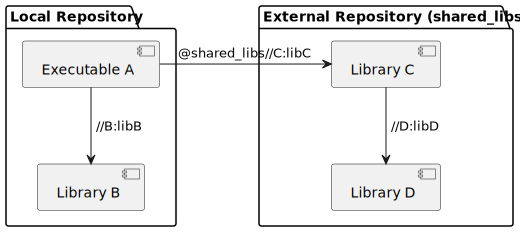
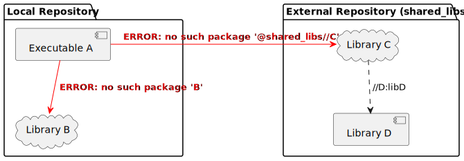
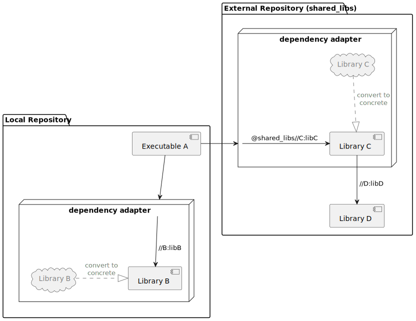

# Abstract

Bazel implicitly requires that all source files within the local repository
exist on disk to run most operations. While this is sufficient for many
environments, there are cases where source files are abstracted off of the
filesystem and must be vivified through a dedicated interface, such as `git
sparse-checkout`.

The goal of this proposal is to introduce APIs to support Bazel builds when
the existence or visibility of a file on the filesystem is controlled
through a separate tool. Specifically, it aims to do this in a way that is
consistent with Bazel's definition of "internal dependencies" to avoid
muddying the distinction between internal and external dependencies. It is
also intended to have no performance impact on users that do not utilize
these APIs.

# Background

The catalyst for this proposal is a desire to improve support for Bazel in a
[`git sparse-checkout`][git-sparse-checkout] environment. In a "sparse
checkout," the source files in a repository do not exist on disk by default.
Instead, they are resolved by invoking the appropriate `git` command (e.g., `git
sparse-checkout add my-folder`).

Today, if a user tries to run something like `bazel build` when some of the
dependent targets aren't on disk, they receive an error like the following:

```
ERROR: /Users/me/bazel-repo/main/BUILD:3:10: no such package 'my-dependency': BUILD file not found in any of the following directories. Add a BUILD file to a directory to mark it as a package.
- /Users/me/bazel-repo/my-dependency and referenced by '//main:my-target'
ERROR: Analysis of target '//main:my-target' failed; build aborted: Analysis failed
```

To avoid errors, a user needs to manually specify all of the internal
dependencies of a target to Git _before_ Bazel builds its own dependency graph.

Some projects[^1][^2][^3] have attempted to solve this problem and use Bazel's
dependency graph as a single source of truth for both Bazel and `git
sparse-checkout`. However, these solutions invariably rely on a third-party tool
to coordinate Bazel and Git, complicating a developer's setup. Additionally,
many still involve maintaining a full (separate) checkout of a repository in
order to generate the Bazel dependency graph, which severely hampers the
performance benefits of `git sparse-checkout`.

An ideal integration between Bazel and `git sparse-checkout` would:

- allow a developer to use unmodified Bazel and Git to manage their repository
- generate sparse-checkout patterns matching a target's dependency tree
- allow Bazel to build/query/etc. a target _without_ starting from a full (i.e.,
  non-sparse) checkout
- require only a one-time change to `WORKSPACE` and/or `BUILD` file(s) to set up
- adhere to Bazel's underlying architectural principles (mainly
  deterministic & hermetic builds)
- not rely on adding Git-specific logic to `bazelbuild/bazel`

The initial investigation and prototypes that led to this proposal first tried
to use the `rule()` and/or `repository_rule()` APIs, but fell short on one or
more criteria. A recurring theme in these attempts was ambiguity as to whether
sparse-checkout source files were internal or external dependencies. Focusing on
that underlying problem changed the approach from "find some way to force
Bazel's APIs to execute arbitrary scripts in the loading phase" to "expand the
build system's capabilities within its existing concept of internal
dependencies."

[git-sparse-checkout]: https://git-scm.com/docs/git-sparse-checkout
[^1]: https://canvatechblog.com/we-put-half-a-million-files-in-one-git-repository-heres-what-we-learned-ec734a764181
[^2]: https://github.com/twitter/focus
[^3]: https://github.com/excitoon/bazel-git-selective-checkout

# Concepts

## Virtual dependencies

Within Bazel, the distinction between "internal" and "external" dependencies
(with respect to a given [target][bazel-target]) is [fairly well-defined][bazel-dependencies].
From that linked documentation, the salient qualities of an internal dependency
are:

- defined and built in the same source repository as a target
- built from source, rather than downloaded as a prebuilt artifact
- no notion of "version," as all internal dependencies are always built at the
  same commit/revision in the repository

These attributes lead to an even more succinct definition: an internal
dependency is a target or [package][bazel-package] within the same
[repository][bazel-repository] as the given target, whereas an external
dependency is a target or package in a different repository. In the image below,
Executable A has _internal_ dependency Library B and _external_ dependencies
Library C (direct) and Library D (transitive).



In Bazel's current state, both internal and external dependencies are assumed to
exist on disk _if and only if_ their associated repository is on disk. Since the
act of building a target in a repository implies that the repository exists,
local dependencies are _always_ expected on disk. When initially resolving an
external dependency, a missing target or package prompts loading via the
appropriate `repository_rule`.

However, as in the case of `git sparse-checkout`, local sources can meet the
requirements of an "internal dependency" by being part of the source repository
but still require explicit resolution to exist on disk. To address this case, we
can introduce the concept of "concrete" and "virtual" dependencies.

1. A **concrete dependency** is a target or package that exists in its entirety
   on-disk. At the time of writing, all Bazel dependencies are implicitly
   required to be concrete dependencies.
2. A **virtual dependency** is a target or package that does not exist on disk,
   but is represented in a repository by some other means. For the purpose of
   this proposal, virtual dependencies _must_ be convertible to and from
   concrete dependencies via a [bijective mapping][bijection].

Note that whether a dependency is concrete or virtual is _independent_ of
whether it is internal or external. In the diagram below, Library B and Library
C are both virtual dependencies (internal and external, respectively). Without a
mechanism to convert them to concrete dependencies, Bazel fails to build
Executable A.



[bazel-dependencies]: https://bazel.build/basics/dependencies#managing_dependencies
[bazel-target]: https://bazel.build/concepts/build-ref#targets
[bazel-package]: https://bazel.build/concepts/build-ref#packages
[bazel-repository]: https://bazel.build/concepts/build-ref#repositories
[bijection]: https://en.wikipedia.org/wiki/Bijection

## Dependency adapters

A **dependency adapter** is defined here as "a tool that converts a virtual
dependency into a concrete dependency and/or vice versa." Because the usage of
on-disk files is so deeply baked into the architecture and rules of Bazel, the
least invasive way to support builds with virtual dependencies is to utilize the
appropriate dependency adapter to convert to concrete dependencies when
necessary.

The theoretical operation of a dependency adapter within Bazel is shown below.
When Bazel identifies Library B and Library C as virtual dependencies of A, the
respective repository's dependency adapter first converts them to concrete,
allowing the build to proceed successfully.



# Goals & Non-Goals

## Goals

### Introduce extension APIs to handle internal virtual dependencies

The core of this proposal is the introduction of a dependency adapter API that
gives developers the ability to build projects with virtual dependencies. Like
third-party rules or repository rules, dependency adapter definitions should be
importable from third-party packages (in both `MODULES.bazel` and `WORKSPACE`).

Although virtual dependencies should be uniformly convertible to and from a
corresponding concrete representation, Bazel only needs dependencies in their
concrete form. As a result, the APIs introduced here only need to handle the
"virtual to concrete" side of dependency adapter functionality.

### Support hermetic builds when using a dependency adapter

Like a `repository_rule`, a dependency adapter could easily introduce
non-[hermetic][bazel-hermetic] behavior into a system. To support hermeticity, a
dependency adapter needs to maintain two things: **isolation** and **source
identity**.

APIs introduced for configuring dependency adapters should allow for downloading
and configuring fixed versions of external tools to preserve _isolation_.
Virtual dependencies were defined earlier as one-to-one mappable to a
corresponding concrete dependency. If users design their adapters to adhere to
this restriction, a given virtual package will have exactly _one_ valid
representation on disk, which could then be converted identically back to the
original virtual representation. This maintains the _source identity_ of the
repository, as the consistent mapping between virtual and concrete allows a
single identity (e.g., a Git commit hash) to represent the dependency regardless
of its physical representation.

[bazel-hermetic]: https://bazel.build/basics/hermeticity#overview

### Allow use of dependency adapters in external repositories

The dependency adapter bound to a repository is an _internal, private_ property
of the repository; it is not a goal of this proposal to allow setting the
dependency adapter of a repository from another repository. However, the
`WORKSPACE` of an external dependency may define its own dependency adapter,
where it will be used internally to resolve any virtual dependencies.

### Maintain performance when no file resolution is required

Any introduced APIs should be opt-in by design, having no real behavior or
performance effects on users that aren't using them. When using the API, if an
internal dependency already exists on disk, the performance impact of skipping
the resolution function should be negligible. On the whole, the performance
impact of the custom dependency resolution should only be incurred when it is
_absolutely_ required.

### Make new APIs compatible with [Bzlmod][bzlmod] & non-Bzlmod projects

Although most of the terminology so far has followed pre-Bzlmod conventions
("repository"/"package" instead of "module"), it is important that new APIs are
usable in a Bzlmod project.

This proposal deals with the handling of internal dependencies, so the
implementation should be functionally nearly identical whether using `WORKSPACE`
or `MODULES.bazel`.

[bzlmod]: https://bazel.build/build/bzlmod

## Non-Goals

### Introduce Git-specific implementation details in core Bazel

Bazel has so far been able to avoid internal dependence on any one version
control system. [Existing integrations with Git][bazel-git-repository] utilize
the extension APIs rather than being baked into the core tool. The `git
sparse-checkout` use case presents no reason to change that, so the proposal
will focus on generalized additions to the extension APIs. Similarly, this
design should not be so narrow as to only help `git sparse-checkout`. Potential
additional use cases include Mercurial's [sparse checkout][hg-sparse-checkout]
feature, or other custom file virtualization; these could be integrated into a
Bazel workspace with the appropriate dependency adapter.

[bazel-git-repository]: https://bazel.build/rules/lib/repo/git
[hg-sparse-checkout]: https://firefox-source-docs.mozilla.org/build/buildsystem/sparse.html


### Support multiple dependency adapters within a single repository

This non-goal is mostly for simplicity. By mandating that a repository can have
_at most_ one dependency adapter associated with it, we don't need to deal with
prioritization of different adapters, scoping them to different contexts, etc.

If a user does want to be able to scope different behavior to different parts of
a repository, they can add such behavior to the implementation of a custom
dependency adapter.

# Implementation

The proposed implementation is a series of additions to Bazel's [global
functions][global-functions] and [built-in types][built-in-types].

[built-in-types]: https://bazel.build/rules/lib/starlark-overview#built-in-types
[global-functions]: https://bazel.build/rules/lib/starlark-overview#global-functions

## Global functions

### `dependency_adapter`

```python
dependency_adapter(
    implementation,
    setup = None,
    teardown = None,
    thread_safe = True,
    attrs = None
)
```

This function creates a new callable `dependency_adapter` and stores it in a
global value. That global callable can then be invoked in the `WORKSPACE` file
to instantiate a new adapter.

#### Parameters

| Parameter | Description |
| --------- | ----------- |
| implementation | required<br>The function that allows Bazel to convert virtual dependencies to concrete ones via a custom interface. The `implementation` is invoked during the loading phase _if and only if_ an internal dependency is not found on disk. Receives two args: an `adapter_ctx` and the `string` path to the file (relative to the workspace root) to be resolved. |
| setup | default = `None`<br>An optional global setup function for the adapter. Invoked lazily before the first invocation of `implementation`. Receives one arg of type `adapter_ctx`. |
| teardown | default = `None`<br>An optional global teardown function for the adapter. Receives a single `adapter_ctx` argument. Invoked only if `implementation` is invoked. |
| thread_safe | default = `True`<br>Indicates whether the user-defined `implementation` function is thread-safe. If `False`, calls to `implementation` will be lock-protected.<br>**Important:** even if `thread_safe` is `True`, Bazel should not invoke simultaneous resolutions of the _same_ file. This should not impact performance, as well as help avoid [time-of-check to time-of-use][toctou] issues. |
| attrs | `dict`; or `None`; default = `None`<br>Dictionary of all the attributes of the adapter. It maps from an attribute name to an attribute object (see `attr` module). Because the filesystem adapter is evaluated during the loading phase, attributes **cannot** have type `Label`. *No attributes are implicitly added.* |

[toctou]: https://en.wikipedia.org/wiki/Time-of-check_to_time-of-use

### `use_dependency_adapter`

In a `MODULE.bazel` file, `use_dependency_adapter()` function loads a callable
`dependency_adapter` from a given module. Unlike module extensions, which
utilize `use_repo()` and tag classes to ensure unified version(s) of the loaded
dependencies, each dependency adapter instance is unique to the `module()` of
the `MODULE.bazel` file. Therefore, the loaded `dependency_adapter` is invoked
directly.

## Built-in types

### `dependency_adapter`

A callable value invoked during evaluation of the `WORKSPACE` or `MODULE.bazel`
file. Invoking the `dependency_adapter` instantiates an adapter and binds it to
the local repository. If multiple dependency adapter instances are created, the
last one created is used in the repository.

Unlike rules, repositories, or modules, the created dependency adapter does not
have a string label, as it cannot be referenced by a user beyond its creation
and binding to the local repo.

### `adapter_ctx`

General workspace context information used by dependency adapters in their
`implementation`, as well as the (optional) `setup` and `teardown`.

Nearly identical to a [`repository_ctx`][repository_ctx], with the sole
exception of `path` being unable to resolve a `Label` (therefore only accepting
`string` or `path` types).

[repository_ctx]: https://bazel.build/rules/lib/repository_ctx

## Example

Suppose we've defined a dependency adapter called `local_adapter`, which converts
virtual dependencies located at some arbitrary path into the corresponding
concrete dependencies. Although inefficient, the way the adapter will convert
from "virtual" to "concrete" is by symlinking to the appropriate file(s).

In `local_adapter.bzl`:

```python
def _impl(adapter_ctx, target):
    adapter_ctx.symlink(adapter_ctx.attr.path + '/' + target,
                        adapter_ctx.workspace_root + '/' + target)

local_adapter = dependency_adapter(
    implementation = _impl,
    attrs= { "path": attr.string(mandatory=True,
                                 doc='Absolute path to the virtualized repo contents') }
)
```

### Without Bzlmod

In `WORKSPACE`

```python
load("@rules_local//:local_adapter.bzl", "local_adapter")

local_adapter(path = "/home/me/virtual-repo")
```

### With Bzlmod

In `MODULES.bzl`

```python
bazel_dep(name = "rules_local", version = "1.0")
local_adapter = use_dependency_adapter("@rules_local//:local_adapter.bzl", "local_adapter")

local_adapter(path = "/home/me/virtual-repo")
```

# Backward compatibility

The `dependency_adapter()` API is an additive change, so older versions of Bazel
will not be able to use the feature. This may impact users 1) if their project
adds `dependency_adapter()` usage before they update Bazel, or 2) if developers
load an external dependency has introduced a `dependency_adapter()`. Therefore,
developers adding `dependency_adapter()` to their projects are advised to
enforce a minimum compatible version for users, e.g., using a `.bazelversion`
file with Bazelisk.
